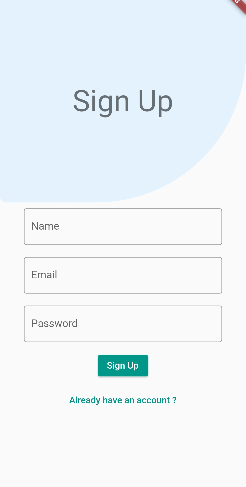

# Flutter Movie App

A movie streaming app built with Flutter, inspired by Netflix. The app utilizes Firebase for user authentication, the TMDB database for movie details, and Razorpay integration for prime membership.

## Features

- User authentication using Firebase
- Browse and search for movies
- View movie details, including synopsis, rating, and cast
- Watch movie trailers
- User profile and account management
- Prime membership with exclusive benefits
- Secure payments using Razorpay integration

## Screenshots

## Installation

1. Clone the repository:

git clone https://github.com/aswinak799/Movie-App-Flutter.git

2. Navigate to the project directory:

3. Install the dependencies:

4. Configure Firebase

   - Create a new Firebase project at [https://console.firebase.google.com/](https://console.firebase.google.com/)
   - Enable Firebase Authentication and choose your desired authentication methods
   - Download the `google-services.json` file from the Firebase project settings and place it in the `android/app` directory of the Flutter project

5. Configure TMDB API

   - Sign up for a free account at [https://www.themoviedb.org/](https://www.themoviedb.org/)
   - Obtain an API key from the TMDB dashboard
   - Replace the placeholder API key in the `lib/services/tmdb_api.dart` file with your TMDB API key

6. Configure Razorpay

   - Sign up for a Razorpay account at [https://razorpay.com/](https://razorpay.com/)
   - Obtain your API key and secret from the Razorpay dashboard
   - Replace the placeholder API key and secret in the `lib/services/razorpay_service.dart` file with your Razorpay API key and secret

7. Run the app:

## Dependencies

- [Flutter](https://flutter.dev/)
- [Firebase](https://firebase.google.com/)
- [TMDB API](https://www.themoviedb.org/)
- [Razorpay](https://razorpay.com/)

## Contributing

Contributions are welcome! If you encounter any issues or have suggestions for improvement, please open an issue or submit a pull request.

